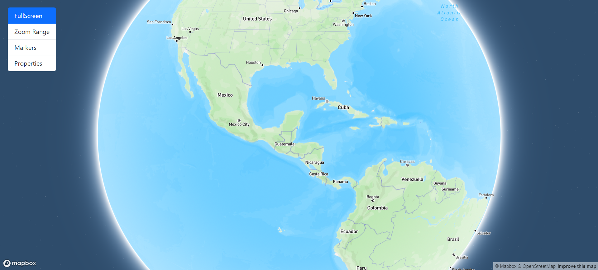
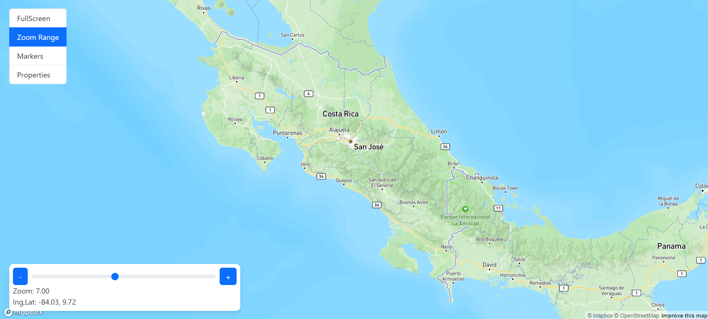
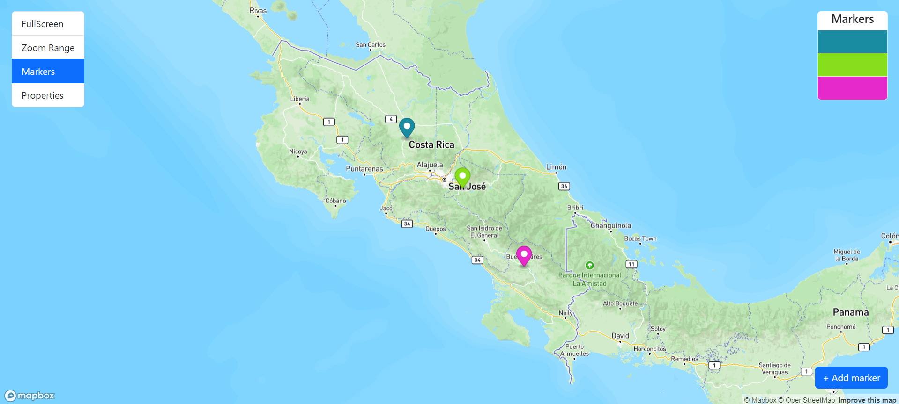
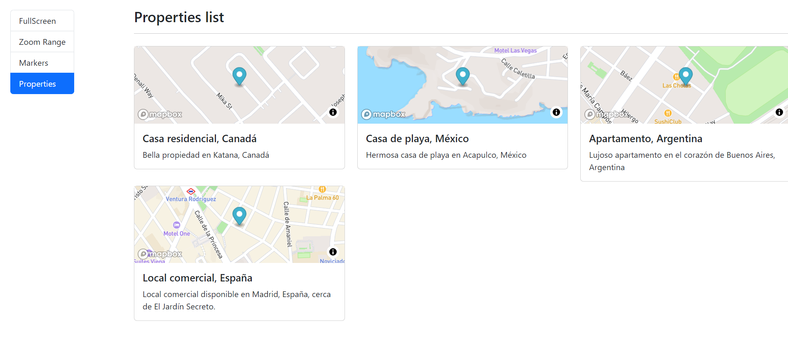

# Maps App

This project consists of an application that uses the Mapbox library to display an interactive map. The application allows to display the map in full screen, zoom in, add markers and access a list of properties.

## How to run it
1. Clone the .env.template and rename it to .env.
2. Fill the environment variables accordingly
3. Create Angular Envs (optional)
```
npm run envs
```

4. For development run:
```
npm run start
```

5. For production run:
```
npm run build
```

Note: Do not run the application directly with AngularCLI (unless the environment variables are created), since the environment variables are created based on the .env.

## Technologies

- HTML5
- CSS3
- JavaScript
- Angular
- Bootstrap 5
- Mapbox: Map library used for map visualization and manipulation.

## Screenshot

### FullScreen


### Markers


### Markers


### Properties


## Links

- Solution URL: [Solution URL here](https://github.com/derianrddev/maps-app)
- Live Site URL: [Live site URL here](https://derianrddev.github.io/maps-app/)
